# System Architecture

## High-Level Architecture

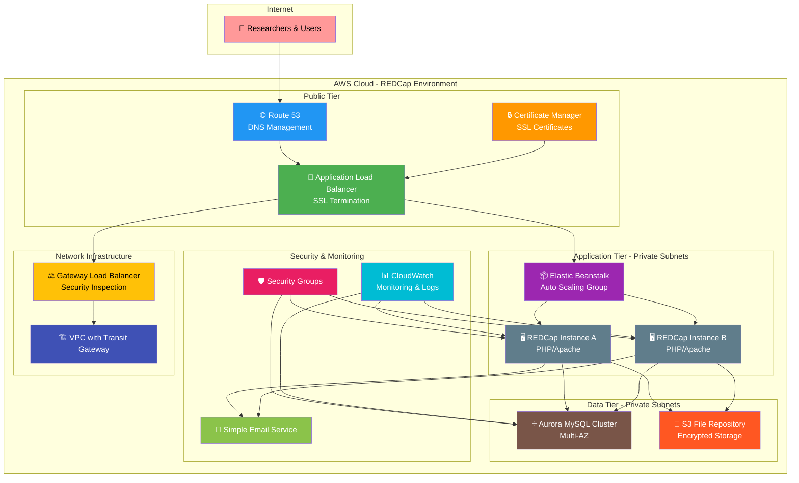

## CloudFormation Stack Architecture

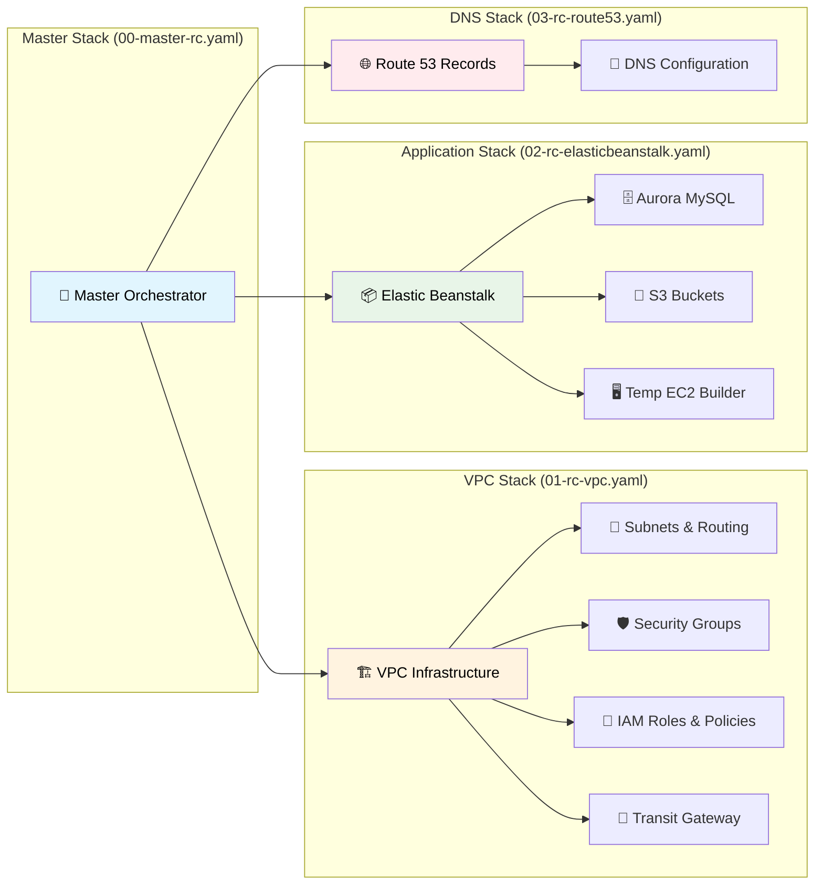

## Design Principles

### 1. Security by Design
- **Defense in Depth**: Multiple security layers from network to application
- **Zero Trust Architecture**: Verify every connection and transaction
- **Encryption Everywhere**: Data encrypted at rest and in transit
- **Least Privilege Access**: Minimal required permissions for all components
- **Network Isolation**: Private subnets with controlled internet access

### 2. High Availability and Resilience
- **Multi-AZ Deployment**: Resources distributed across availability zones
- **Auto Scaling**: Dynamic scaling based on demand and health checks
- **Load Balancing**: Traffic distribution with health monitoring
- **Database Clustering**: Aurora MySQL with automatic failover
- **Backup and Recovery**: Automated backups with point-in-time recovery

### 3. HIPAA Compliance Architecture
- **Data Encryption**: All PHI encrypted using AWS KMS
- **Access Logging**: Comprehensive audit trails for all data access
- **Network Security**: VPC isolation with security group controls
- **Administrative Safeguards**: IAM roles and policies for access control
- **Physical Safeguards**: AWS data center security and compliance

### 4. Cost Optimization
- **Right-Sizing**: Appropriate instance types for workload requirements
- **Auto Scaling**: Pay only for resources actually needed
- **Reserved Capacity**: Cost savings for predictable workloads
- **Storage Optimization**: Intelligent tiering and lifecycle policies

## Key Components

### VPC Infrastructure (`01-rc-vpc.yaml`)

#### Network Architecture
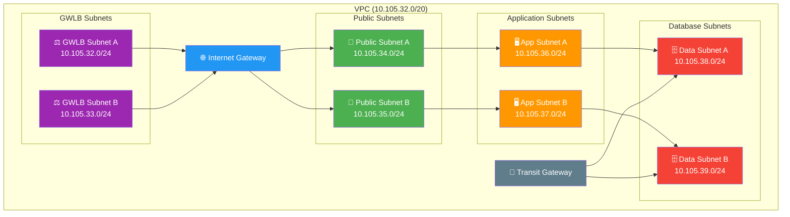

#### Security Groups
- **Public Security Group**: Controls ALB access (HTTP/HTTPS)
- **Application Security Group**: Controls EC2 instance access
- **Database Security Group**: Restricts database access to application tier only
- **Default Security Group**: Cleaned up and secured per AWS best practices

#### IAM Roles and Policies
- **Elastic Beanstalk Service Role**: Platform management permissions
- **EC2 Instance Profile**: Application-specific permissions
- **Temporary EC2 Role**: REDCap installation and configuration
- **S3 Access User**: File repository access for REDCap

### Application Platform (`02-rc-elasticbeanstalk.yaml`)

#### Elastic Beanstalk Configuration
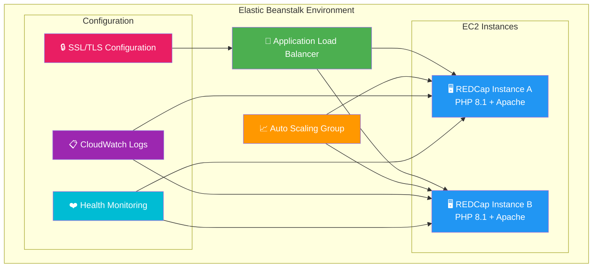

#### Database Architecture
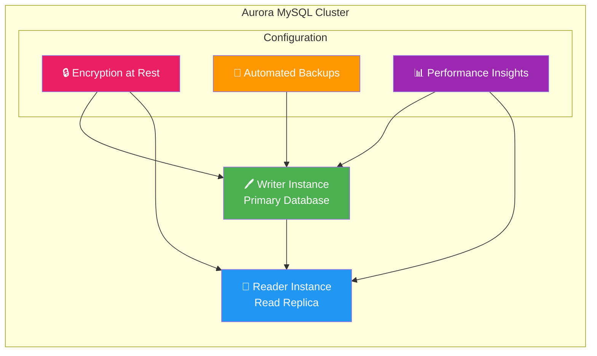

#### REDCap Installation Process
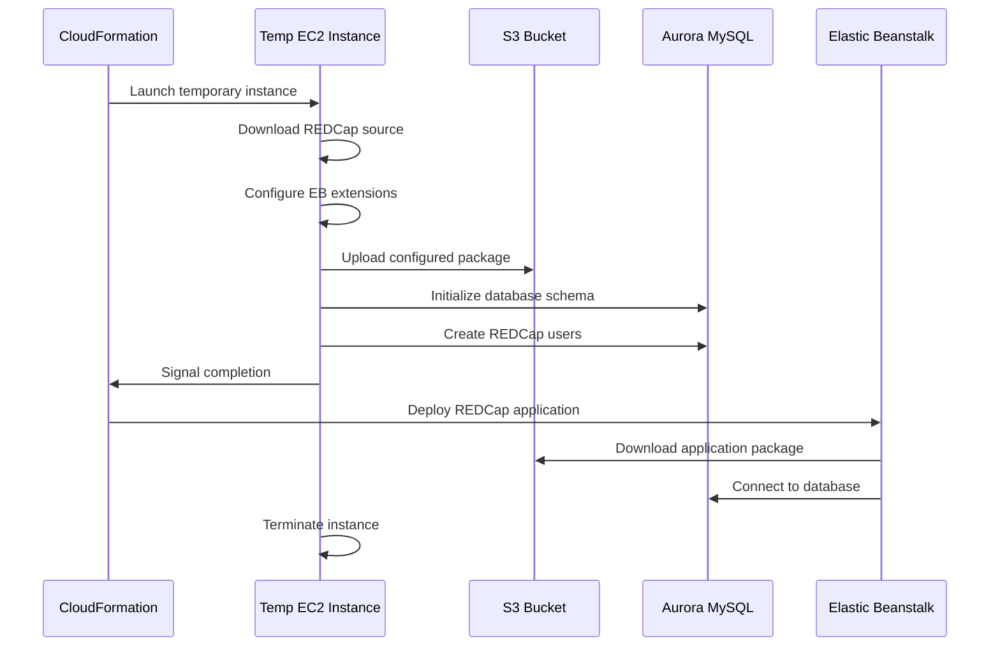

### DNS and SSL Management (`03-rc-route53.yaml`)

#### DNS Architecture
- **Route 53 Hosted Zone**: Manages domain DNS records
- **A Record**: Points domain to ALB endpoint
- **Health Checks**: Monitors application availability
- **SSL Certificate**: ACM-managed certificate with auto-renewal

## Security Architecture

### Network Security
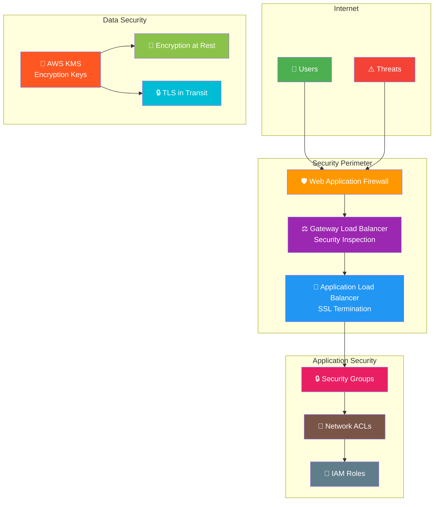

### Data Flow Security
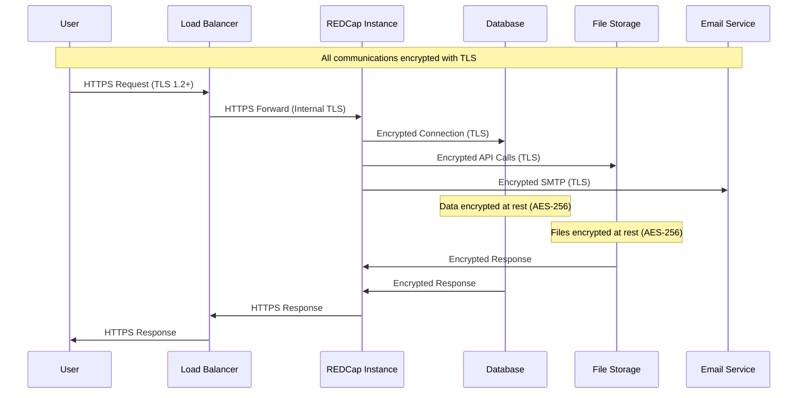

## Scalability and Performance

### Auto Scaling Architecture
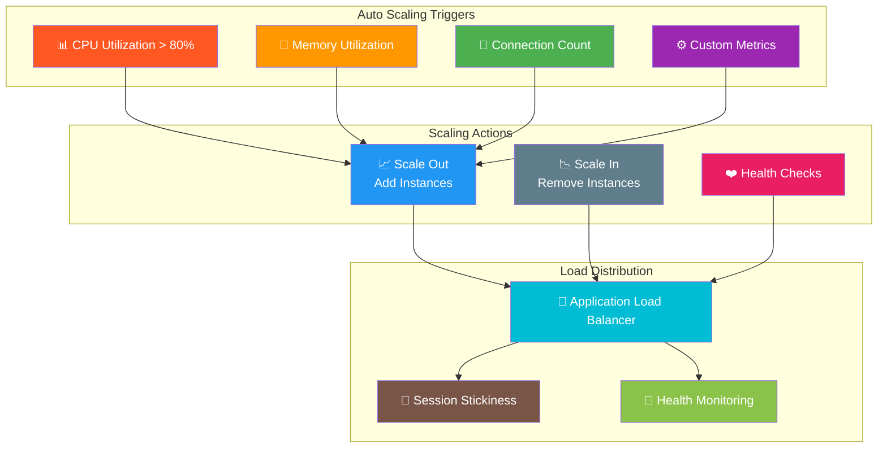

### Performance Optimization
- **Database Performance**: Aurora MySQL with optimized parameters
- **Application Caching**: PHP OPcache and session management
- **Static Content**: S3 for file storage with optional CloudFront CDN
- **Connection Pooling**: Optimized database connections
- **Resource Right-Sizing**: Instance types matched to workload requirements

## Disaster Recovery and Backup

### Backup Strategy
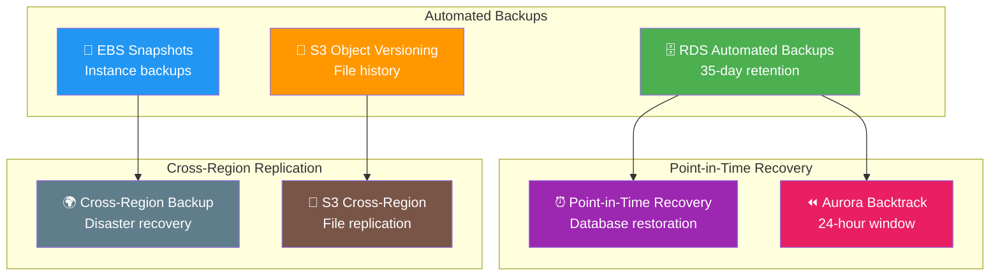

## Monitoring and Observability

### Monitoring Architecture
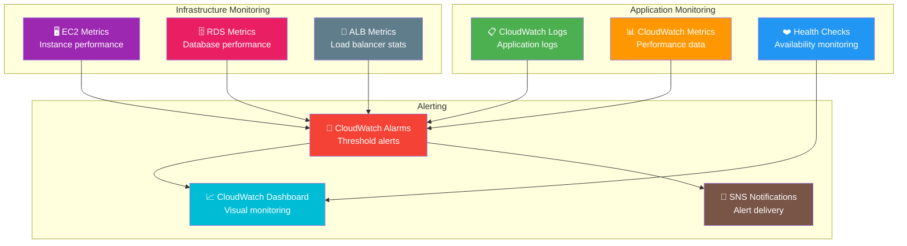