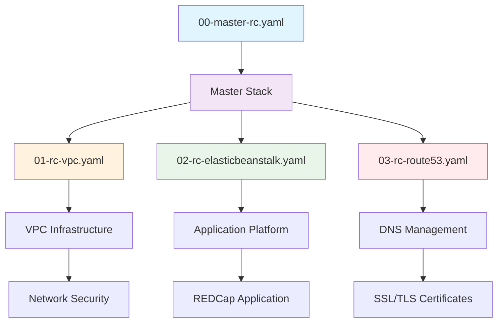

# REDCap AWS CloudFormation Deployment Project

## Problem Statement

Research institutions and healthcare organizations face significant challenges when deploying REDCap (Research Electronic Data Capture) systems in the cloud. REDCap is a critical platform for clinical research data collection, requiring:

- **HIPAA Compliance**: Strict security controls for protected health information (PHI)
- **High Availability**: Mission-critical research operations cannot afford downtime
- **Scalability**: Ability to handle varying research loads and user volumes
- **Security**: Multi-layered security architecture with encryption and access controls
- **Regulatory Compliance**: Meeting institutional and federal compliance requirements
- **Cost Efficiency**: Optimized infrastructure costs while maintaining performance

Manual deployment of REDCap infrastructure is complex, time-consuming, and prone to security misconfigurations that could compromise sensitive research data.

## Project Purpose

This project provides a comprehensive Infrastructure as Code (IaC) solution for deploying REDCap on AWS using CloudFormation templates. The solution addresses:

- **Automated Deployment**: Complete REDCap environment deployed in ~20 minutes
- **Security by Design**: Built-in HIPAA compliance and security best practices
- **High Availability**: Multi-AZ deployment with auto-scaling capabilities
- **Cost Optimization**: Right-sized resources with automated scaling
- **Compliance**: Encryption at rest and in transit, audit logging, backup strategies
- **Maintainability**: Infrastructure as Code with version control and repeatability

## How the System Works

The REDCap deployment uses a nested CloudFormation stack architecture:

### Deployment Flow

1. **Master Stack Orchestration**: Coordinates all nested stacks and dependencies
2. **VPC Infrastructure**: Creates isolated network environment with security groups
3. **Database Deployment**: Aurora MySQL cluster with encryption and backups
4. **Application Platform**: Elastic Beanstalk environment with auto-scaling
5. **DNS and SSL**: Route 53 records and ACM certificates for secure access
6. **REDCap Installation**: Automated REDCap source deployment and configuration

## Core Requirements

### Functional Requirements

#### REDCap Platform Features
- **Data Collection**: Secure web-based surveys and databases
- **User Management**: Role-based access control and authentication
- **Data Export**: Multiple export formats with audit trails
- **API Access**: RESTful API for external integrations
- **Mobile Support**: Mobile-responsive interface for field data collection
- **Reporting**: Built-in reporting and dashboard capabilities

#### Infrastructure Components
- **Web Tier**: Auto-scaling PHP/Apache servers on Elastic Beanstalk
- **Database Tier**: Aurora MySQL with Multi-AZ deployment option
- **Storage Tier**: S3 for file repository with encryption
- **Load Balancing**: Application Load Balancer with SSL termination
- **Monitoring**: CloudWatch logging and performance monitoring

### Non-Functional Requirements

#### Security and Compliance
- **HIPAA Compliance**: All components configured for HIPAA requirements
- **Encryption**: Data encrypted at rest (EBS, RDS, S3) and in transit (SSL/TLS)
- **Network Isolation**: VPC with private subnets and security groups
- **Access Control**: IAM roles with least privilege principles
- **Audit Logging**: Comprehensive logging for compliance and monitoring
- **Backup and Recovery**: Automated backups with point-in-time recovery

#### Performance and Scalability
- **Auto Scaling**: Dynamic scaling based on CPU utilization and demand
- **High Availability**: Multi-AZ deployment across availability zones
- **Load Distribution**: Intelligent traffic routing and session persistence
- **Database Performance**: Optimized Aurora MySQL configuration
- **CDN Integration**: CloudFront for static content delivery (optional)

#### Operational Excellence
- **Infrastructure as Code**: Version-controlled CloudFormation templates
- **Automated Deployment**: One-click deployment with parameter customization
- **Monitoring and Alerting**: Proactive monitoring with CloudWatch
- **Maintenance Windows**: Scheduled maintenance with minimal downtime
- **Disaster Recovery**: Cross-region backup and recovery capabilities

## Target Outcomes

### Research Institution Benefits
- **Rapid Deployment**: REDCap environment ready in under 30 minutes
- **Compliance Assurance**: Built-in HIPAA and security compliance
- **Cost Predictability**: Transparent pricing with auto-scaling optimization
- **Reduced IT Overhead**: Managed services reduce operational burden
- **Enhanced Security**: Enterprise-grade security without complexity

### Technical Achievements
- **99.9% Uptime**: High availability architecture with automatic failover
- **Elastic Scaling**: Handle 10x traffic spikes without manual intervention
- **Security Posture**: Zero security incidents through defense-in-depth
- **Performance**: Sub-2 second page load times under normal load
- **Compliance**: 100% compliance with institutional security requirements

### Operational Improvements
- **Deployment Time**: Reduced from weeks to hours
- **Security Configuration**: Eliminated manual security misconfigurations
- **Backup Reliability**: Automated, tested backup and recovery procedures
- **Cost Optimization**: 30-40% cost reduction compared to traditional hosting
- **Maintenance Efficiency**: Automated patching and maintenance procedures

## Development Approach

### Infrastructure as Code Principles
- **Version Control**: All infrastructure definitions stored in Git
- **Peer Review**: Code review process for all infrastructure changes
- **Testing**: Validation in non-production environments before deployment
- **Documentation**: Comprehensive inline and external documentation
- **Modularity**: Reusable templates for different deployment scenarios

### Security-First Design
- **Defense in Depth**: Multiple layers of security controls
- **Least Privilege**: Minimal required permissions for all components
- **Encryption Everywhere**: Data protection at rest and in transit
- **Network Segmentation**: Isolated network tiers with controlled access
- **Audit and Monitoring**: Comprehensive logging and monitoring

### Deployment Strategy
- **Blue/Green Deployment**: Zero-downtime application updates
- **Rollback Capability**: Quick recovery from failed deployments
- **Environment Parity**: Identical infrastructure across environments
- **Automated Testing**: Infrastructure validation and application testing
- **Progressive Rollout**: Staged deployment with validation gates

### Operational Model
- **GitOps Workflow**: Infrastructure changes through Git workflows
- **Automated Monitoring**: Proactive issue detection and alerting
- **Self-Healing**: Automatic recovery from common failure scenarios
- **Capacity Planning**: Predictive scaling based on usage patterns
- **Disaster Recovery**: Multi-region backup and recovery strategies